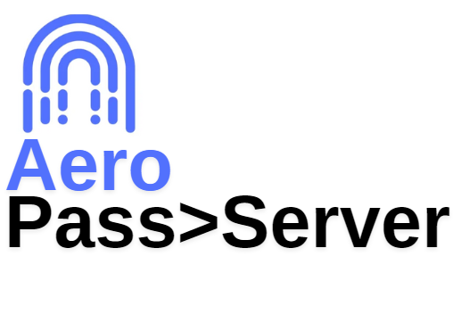
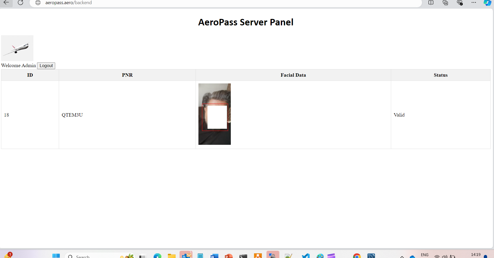

# Aeropass Server
- Lets you view active travel tokens and their status.
- Its backend for front facing aero pass app and serves as API interface for gates to validate facial biometrics.
- Its flexible and has APIs available to integrate with airport DCS and other airport systems.
- Aeropass gate control calls the end point on this platform to verify facials for that PNR

  > Once the BP is shared from APP the token flows to this platform as shown below.

  
